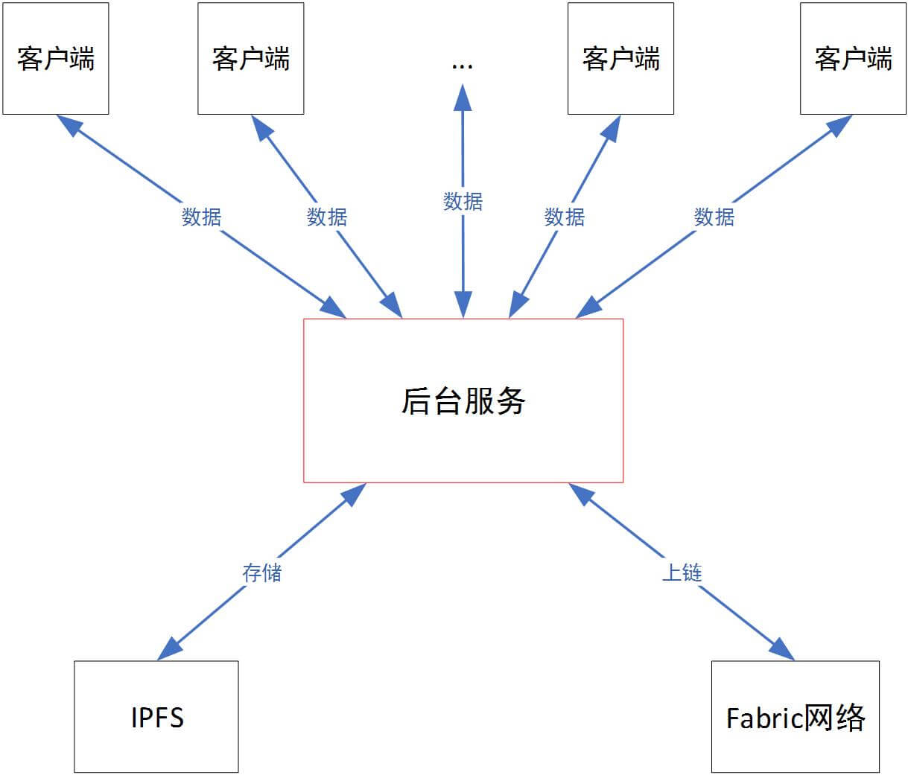

一个Fabric+IPFS数据上链的Demo

  **Fabric简介、适用场景**：Hyperledger Fabric的出现是对传统区块链模型的一种革新，在某种程度上允许创建授权和非授权的区块链，Hyperledger还通过提供一个针对身份识别，可审计、隐私安全和健壮的模型，使得缩短计算周期、提高规模效率和响应各个行业的应用需求成为可能。
  **Fabric+IPFS优点、适用场景**：无需全部数据上链即可产生信任。
  传统区块链系统为了“安全”而牺牲“效率”，因此其数据存储的容量与速率非常低下，因此不能存放大规模数据。基于这种考虑，我们利用区块链+分布式存储的方式解决大规模数据上链的问题，将原始数据存于类似IPFS等分布式系统中，将源文件的地址存储于区块链永久保存，用户可以通过区块链上文件的地址信息去获取这些数据。同时为了保证IPFS上数据不被篡改，将文件的指纹（Hash算法结果）也一并存入区块链，这样用户可以将得到的链上数据进行验证，以确定数据的完整性与可靠性。
  
  后台服务采用nodejs编写，总体功能可分为两部分：
  数据存储：后台可将数据打包成块并向IPFS发送，所有数据存储在IPFS上，然后将IPFS上文件存储地址以及文件指纹存在Fabric区块链网络上，这样可公开验证数据。
  数据查询：客户端可以通过查询内容的方式，即基于内容检索得到Fabric以及IPFS上具体信息。
  
  **运行环境**
   硬件支持：
   后台服务需要Fabric区块链网络以及IPFS节点的支持。
   软件支持：
   go-ipfs version: 0.4.18
   nodejs version: 8.1.0
   go version :go1.9.2 windows/amd64
   docker version: 18.09.2
   docker-compose version: 1.23.2
   Hyperledger Fabric version: 1.1.0
   ipfs version: 0.4.18
  **功能设计详细描述**
  1.数据存储
  数据存储功能步骤：
  (1) 客户端通过http-post方式以特定数据格式（Json）向后台服务发送数据
  该后端服务会记录每一个连接的客户端处发来数据数目，并更新其数据文件指纹，当达到预设值时，进行打包操作，并使用流的方式向IPFS发送数据。
  (2) 数据块存储在IPFS上，然后返回存储地址
  (3) 后台服务将先前计算的文件指纹与IPFS文件存储地址组合且生成新的一条上链数据，然后通过调用Fabric链码将信息存储在Peer节点账本上。
  (4) Fabric向服务端返回本次存储交易的Hash值。
  2.数据查询
  数据查询功能步骤：
  (1) 客户端通过唯一ID值和日期等内容查询相关信息，通过http-get方式向服务后台请求数据。例如请求url：http://localhost:60003/querydata?obdid=X7777-S6665&date=2024-4-3 ，是用户查询的接口，意思是ID为X7777-S6665日期为2019-4-3这天的该日数据块。
  (2) 后台将会自动启动Fabric链码容器，执行链码中相应的查询方法。
  (3) Fabric将匹配正确的数据(包含IPFS文件存储地址以及文件指纹)返回。例如如下信息：
  (4) 后台通过Fabric数据中的IPFS文件存储地址去查询IPFS网络，并返回匹配的整个数据块。
  (5) IPFS根据Hash地址返回对应的整个数据块的文件信息，随后在服务端可以进行对文件的验证，以检验存储数据是否被篡改。
  **运行说明**
  (1)客户端上传数据
  用户通过http-post方式向服务后台传输Json数据，新客户端向服务端不断发送数据，启动模拟数据服务（每秒向后台发送一次数据）.
  (2) 后端接受数据并处理
  后台系统网络全部启动完毕之后（Fabric网络启动，IPFS启动），使用命令运行nodejs后台程序：node server.js
  (3) 客户端查询/验证数据
  查询fabric区块链网络上相关数据：通过唯一ID（obdid）以及日期来查询fabric上文件存储记录，可以得到IPFS上文件存储地址ipfsAddr，文件的指纹哈希fileFingerprint。查询IPFS上相关数据：将ipfsAddr作为http-post的参数传给服务器，通过该ipfsAddr可以再次查询到IPFS上整个数据块。